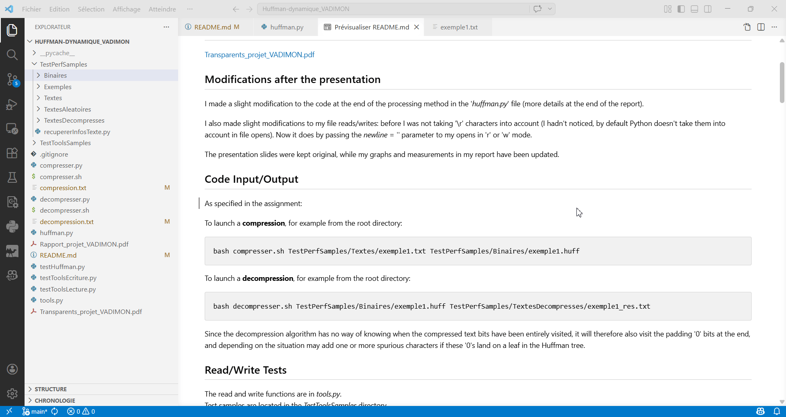

# 🎬 Demonstration



# [EN] Huffman-adaptative

**David VADIMON**  

## Report (in french)

[Rapport_projet_VADIMON.pdf](Rapport_projet_VADIMON.pdf)

## Presentation Slides (in french)

[Transparents_projet_VADIMON.pdf](Transparents_projet_VADIMON.pdf)

## Modifications after the presentation

I made a slight modification to the code at the end of the processing method in the '*huffman.py*' file (more details at the end of the report).  

I also made slight modifications to my file reads/writes: before I was not taking '\r' characters into account (I hadn't noticed, by default Python doesn't take them into account in file opens). Now it does by passing the *newline = ''* parameter to my opens in 'r' or 'w' mode.   

The presentation slides were kept original, while my graphs and measurements in my report have been updated.  

## Code Input/Output

As specified in the assignment:  

To launch a **compression**, for example from the root directory:
```bash
bash compresser.sh TestPerfSamples/Textes/exemple1.txt TestPerfSamples/Binaires/exemple1.huff
```

To launch a **decompression**, for example from the root directory:
```bash
bash decompresser.sh TestPerfSamples/Binaires/exemple1.huff TestPerfSamples/TextesDecompresses/exemple1_res.txt
```

Since the decompression algorithm has no way of knowing when the compressed text bits have been entirely visited, it will therefore also visit the padding '0' bits at the end, and depending on the situation may add one or more spurious characters if these '0's land on a leaf in the Huffman tree.   

## Read/Write Tests

The read and write functions are in *tools.py*.  
Test samples are located in the *TestToolsSamples* directory.  

To use the test programs, for example from the root directory:  
```bash
python3 ./testToolsEcriture.py TestToolsSamples/chaine1.txt TestToolsSamples/chaine1.bin
```

```bash
python3 ./testToolsLecture.py TestToolsSamples/chaine1.bin
```

## Huffman adaptative tree (HAT) construction Test

All HAT manipulation methods, as well as its structure, are in *huffman.py*.  

To use the test program, for example from the root directory:  
```bash
python3 ./testHuffman.py carambarbcm
```
Note that it is possible to build the HAT step by step by successively calling the program with the strings 'c', then 'ca', then 'car', etc. until reaching 'carambarbcm'. Then, at each step the tree gives the expected codes.  

## Compression/Decompression Test

The various test samples are in the *TestPerfSamples* directory.  
- In its *Exemples* subdirectory: provided samples.  
- In its *Textes* subdirectory: text files created manually or collected via the Gutenberg project.  
- In its *TextesDecompresses* subdirectory: text files created by decompression of binaries.  
- In its *TextesAleatoires* subdirectory: text files created randomly by local python code.  
- In its *Binaires* subdirectory: binary files created (by text compression).  

### Compression

The compression function is in *compresser.py*, compression information is added to *compression.txt*.  

To directly use the compression program, for example from the root directory:  
```bash
python3 ./compresser.py TestPerfSamples/Textes/exemple1.txt TestPerfSamples/Binaires/exemple1.huff
```

### Decompression

The decompression function is in *decompresser.py*, decompression information is added to *decompression.txt*.  

To directly use the decompression program, for example from the root directory:  
```bash
python3 ./decompresser.py TestPerfSamples/Binaires/exemple1.huff TestPerfSamples/TextesDecompresses/exemple1_res.txt
```

## Random Text Generation

Texts are generated in the *TestPerfSamples/TextesAleatoires* subdirectory, with the '*genererTexte.py*' code:
Several arguments on call:  
- nom_fichier_a_creer (file name to create)
- nb_caracteres_fichier (number of characters in file)
- langue (optional) (language):  
    - 1 -> all French characters (default)
    - 2 -> all Latin characters
    - 3 -> all displayable UTF-8 characters
- unbalanced (optional):  
    - 0 -> uniform character sampling (default)
    - 1 -> non-uniform character sampling

For example the following call will create a text file of 100 French characters, with random character appearance probabilities:  
```bash
cd TestPerfSamples/TextesAleatoires
python3 ./genererTexte.py fr_unbalanced_100.txt 100 1 1
```

Another example, for which a 1000 character utf-8 file, with uniform probabilities, will be created:  
```bash
cd TestPerfSamples/TextesAleatoires
python3 ./genererTexte.py utf8_1000.txt 1000 3 0
```

## Retrieving text file information (used for analysis)

```bash
cd TestPerfSamples
python3 ./recupererInfosTexte.py Textes/exemple2.txt
```

# [FR] Huffman-dynamique (adaptatif)

**David VADIMON**  

## Rapport

[Rapport_projet_VADIMON.pdf](Rapport_projet_VADIMON.pdf)

## Transparents de la soutenance

[Transparents_projet_VADIMON.pdf](Transparents_projet_VADIMON.pdf)

## Modifications suite à la soutenance

J'ai effectué une légère modification du code à la fin de la méthode de traitement dans le fichier '*huffman.py*' (plus de précisions à la fin du rapport).  

J'ai également effectué de légères modifications sur mes lectures/écritures de fichiers : avant je ne prenais pas en compte les caractères '\r' (je ne m'en étais pas rendu compte, par défaut Python ne les prend pas en compte dans les open de fichiers). Maintenant c'est le cas en passant le paramètre *newline = ''* à mes open en mode 'r' ou 'w'.   

Les transparents de la soutenance ont été gardés originaux, tandis que mes graphes et mes mesures dans mon rapport ont été mis à jour.  

## Entrées/Sorties du code

Comme spécifié dans le sujet :  

Pour lancer une **compression**, par exemple depuis le répertoire racine :
```bash
bash compresser.sh TestPerfSamples/Textes/exemple1.txt TestPerfSamples/Binaires/exemple1.huff
```

Pour lancer une **décompression**, par exemple depuis le répertoire racine :
```bash
bash decompresser.sh TestPerfSamples/Binaires/exemple1.huff TestPerfSamples/TextesDecompresses/exemple1_res.txt
```

Étant donné que l'algorithme de décompression n'a aucun moyen de savoir quand les bits du texte compressé ont été entièrement visités, il va donc également visiter les bits '0' de padding en fin, et en fonction peut ajouter un ou plusieurs caractères parasites si ces '0' le font tomber sur une feuille dans l'arbre de Huffman.   

## Tests lecture/écriture

Les fonctions de lecture et d'écriture sont dans *tools.py*.  
Les échantillons de tests sont situés dans le répertoire *TestToolsSamples*.  

Pour utiliser les programmes de tests, par exemple depuis le répertoire racine :  
```bash
python3 ./testToolsEcriture.py TestToolsSamples/chaine1.txt TestToolsSamples/chaine1.bin
```

```bash
python3 ./testToolsLecture.py TestToolsSamples/chaine1.bin
```

## Test construction de l'AHA

Toutes les méthodes de manipulation de l'AHA, ainsi que sa structure, sont dans *huffman.py*.  

Pour utiliser le programme de test, par exemple depuis le répertoire racine :  
```bash
python3 ./testHuffman.py carambarbcm
```
À noter qu'il est possible de construire l'AHA étape par étape en appellant successivement le programme avec les chaînes 'c', puis 'ca', puis 'car', etc.. jusqu'à arriver à 'carambarbcm'. Alors, à chaque étape l'arbre donne les codes attendus tels que dans le cours.  

## Test compression/décompression

Les différents samples de tests sont dans le répertoire *TestPerfSamples*.  
- Dans son sous-répertoire *Exemples* : des samples fournis.  
- Dans son sous-répertoire *Textes* : des fichiers textuels créés manuellement ou recueillis via le projet Gutenberg.  
- Dans son sous-répertoire *TextesDecompresses* : des fichiers textuels créés par décompression de binaires.  
- Dans son sous-répertoire *TextesAleatoires* : des fichiers textes créés aléatoirement par le code python local.  
- Dans son sous-répertoire *Binaires* : des fichiers binaires créés (par compression de textes).  

### Compression

La fonction de compression est dans *compresser.py*, les infos des compressions sont ajoutées dans *compression.txt*.  

Pour utiliser directement le programme de compression, par exemple depuis le répertoire racine :  
```bash
python3 ./compresser.py TestPerfSamples/Textes/exemple1.txt TestPerfSamples/Binaires/exemple1.huff
```

### Décompression

La fonction de décompression est dans *decompresser.py*, les infos des décompressions sont ajoutées *dans decompression.txt*.  

Pour utiliser directement le programme de décompression, par exemple depuis le répertoire racine :  
```bash
python3 ./decompresser.py TestPerfSamples/Binaires/exemple1.huff TestPerfSamples/TextesDecompresses/exemple1_res.txt
```

## Génération aléatoire de textes

Les textes sont générés dans le sous-répertoire *TestPerfSamples/TextesAleatoires*, avec le code '*genererTexte.py*' :
Plusieurs arguments à l'appel :  
- nom_fichier_a_creer  
- nb_caracteres_fichier  
- langue (optionnel) :  
    - 1 -> tous les caractères français (par défaut)
    - 2 -> tous les caractères latins
    - 3 -> tous les caractères UTF-8 affichables
- unbalanced (optionnel) :  
    - 0 -> tirage uniforme des caractères (par défaut)
    - 1 -> tirage non uniforme des caractères

Par exemple l'appel suivant va créer un fichier textuel de 100 caractères français, avec des probas d'apparitions de caractères aléatoires :  
```bash
cd TestPerfSamples/TextesAleatoires
python3 ./genererTexte.py fr_unbalanced_100.txt 100 1 1
```

Autre exemple, pour lequel un fichier de 1000 caractères utf-8, avec probas uniformes, va être créé :  
```bash
cd TestPerfSamples/TextesAleatoires
python3 ./genererTexte.py utf8_1000.txt 1000 3 0
```

## Récupération des infos d'un fichier texte (utilisé pour l'analyse)

```bash
cd TestPerfSamples
python3 ./recupererInfosTexte.py Textes/exemple2.txt
```